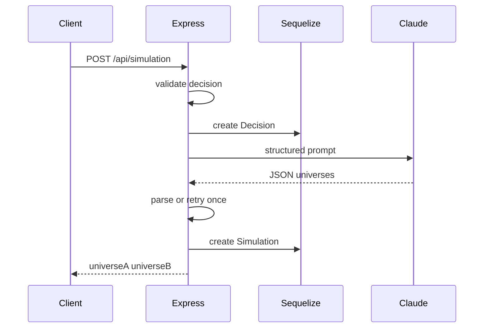

# Express + Sequelize + PostgreSQL simulation API

## Context

- Current stack: [package.json](package.json) + [src/index.js](src/index.js) — Express only, no DB.
- Spec: [docs/api_requierment.txt](docs/api_requierment.txt) — Decisions + Simulations tables, `POST /api/simulation`, `GET /api/simulation/history`, `GET /api/simulation/:id`, Claude returns strict JSON, validation, logging, optional retry on JSON parse failure.

## Database connection (local)

Map your Python-style settings to Node `process.env` (same names work in shell):


| Variable     | Default (per your note) |
| ------------ | ----------------------- |
| `PGHOST`     | `localhost`             |
| `PGPORT`     | `5432`                  |
| `PGUSER`     | `utsavgohel`            |
| `PGPASSWORD` | `""`                    |
| `PGDATABASE` | `bench_pgvector`        |


**Implementation:** Add [src/config/database.js](src/config/database.js) (or `src/db.js`) that exports a configured `Sequelize` instance:

- `new Sequelize(process.env.PGDATABASE, process.env.PGUSER, process.env.PGPASSWORD || '', { host, port, dialect: 'postgres', logging: false or a simple logger })`
- Load [dotenv](https://www.npmjs.com/package/dotenv) at the very top of [src/index.js](src/index.js) (`require('dotenv').config()`).

**Prerequisite:** PostgreSQL running locally; database `bench_pgvector` exists (or create it once: `createdb bench_pgvector`). User `utsavgohel` must have connect rights.

## Dependencies to add

- `sequelize`, `pg` — ORM + driver  
- `dotenv` — env  
- `@anthropic-ai/sdk` — Claude (spec allows SDK instead of raw axios)

## Project layout (suggested)

```
src/
  index.js                 # dotenv, express, mount routes, sync DB, listen
  config/database.js       # Sequelize singleton
  models/
    index.js               # init models + associations
    Decision.js
    Simulation.js
  routes/simulation.js     # POST /, GET /history, GET /:id mounted at /api/simulation
  services/claude.js       # build prompt, call API, parse JSON, one retry
  middleware/validateDecision.js
```

## Sequelize models

**Decision**

- `id` — UUID or INTEGER PK (auto)
- `decision_text` — STRING(300) or TEXT, `allowNull: false`
- `created_at`, `updated_at` — Sequelize timestamps

**Simulation**

- `id` — PK
- `decision_id` — FK → `decisions.id`, `onDelete: 'CASCADE'` or `RESTRICT` (pick one; CASCADE is fine for hackathon)
- `universe_a` — JSONB (or JSON) — array of `{ year, story }`
- `universe_b` — same
- `created_at`

Association: `Decision.hasMany(Simulation)` / `Simulation.belongsTo(Decision)` — for history joins.

**Schema sync:** For fast hackathon dev, `sequelize.sync({ alter: true })` on startup in dev only, or a single Sequelize migration file; document production preference for migrations.

## API behavior (aligned with spec)

1. **POST `/api/simulation`**
  - Body: `{ "decision": "..." }`
  - Validate: non-empty, length `> 5` and `< 300` (trimmed)
  - Log: incoming request
  - `Decision.create({ decision_text })`
  - Call Claude with system/user prompt requiring **only** JSON: `{ "universeA": [{ "year", "story" }], "universeB": [...] }` — 5 entries each, years as in spec (e.g. 2026–2030)
  - Max tokens ~700–900; handle timeout (e.g. AbortController or SDK timeout if available)
  - Parse JSON; on failure, **retry Claude once**; if still bad → 502 + log
  - `Simulation.create({ decision_id, universe_a, universe_b })` — map API field names to DB columns
  - Response: structured JSON matching frontend (same shape as spec; normalize keys if frontend expects `universeA` vs snake_case in DB)
2. **GET `/api/simulation/history`**
  - `findAll` with `include: Decision`, `order: [['created_at', 'DESC']], limit: 10`
  - Return decision text, simulation payloads, dates
3. **GET `/api/simulation/:id`**
  - `findByPk` with `include: Decision`; 404 if missing

**Errors:** 400 invalid input; 502 AI/parse; 500 DB — consistent `{ error: string }` body.

## Claude service ([src/services/claude.js](src/services/claude.js))

- Read `ANTHROPIC_API_KEY` from env
- Model: e.g. `claude-sonnet-4-20250514` or current Sonnet alias from Anthropic docs
- Prompt: Universe A = user takes decision; Universe B = does not; 5-year timelines; realistic themes (career, relationships, growth, regrets, happiness); **output JSON only**, no markdown fences
- Strip optional

```json fences if model adds them before `JSON.parse`

## Cross-origin

- If frontend is separate origin: `cors` package + `app.use(cors({ origin: process.env.FRONTEND_ORIGIN || true }))` for hackathon; tighten for production.

## Logging

- Console logs (or minimal `pino` if you want): request received, AI start, AI done, simulation saved; errors for AI/DB/parse.

## Files to touch


| File                         | Purpose                                                                                                           |
| ---------------------------- | ----------------------------------------------------------------------------------------------------------------- |
| [package.json](package.json) | scripts + new deps                                                                                                |
| `.env.example`               | `PGHOST`, `PGPORT`, `PGUSER`, `PGPASSWORD`, `PGDATABASE`, `ANTHROPIC_API_KEY`, `PORT`, optional `FRONTEND_ORIGIN` |
| [src/index.js](src/index.js) | dotenv, cors, `/api/simulation` router, `sequelize.sync`, start server after DB authenticate                      |
| New files under `src/`       | As in layout above                                                                                                |


## Flow (mermaid)




## Order of implementation

1. Install deps; add `.env` from `.env.example` with your real password and DB name.
2. `config/database.js` + `models/*` + `sequelize.authenticate()` + `sync` in `index.js`.
3. `services/claude.js` with mock or real key smoke test.
4. `routes/simulation.js` — wire POST/GETs and validation.
5. Manual test with `curl`/Postman; optional `FRONTEND_ORIGIN` + CORS.

No change to the FutureSelf Next.js plan unless you later merge this API into a monorepo — this deliverable is a standalone Express backend per [docs/api_requierment.txt](docs/api_requierment.txt).